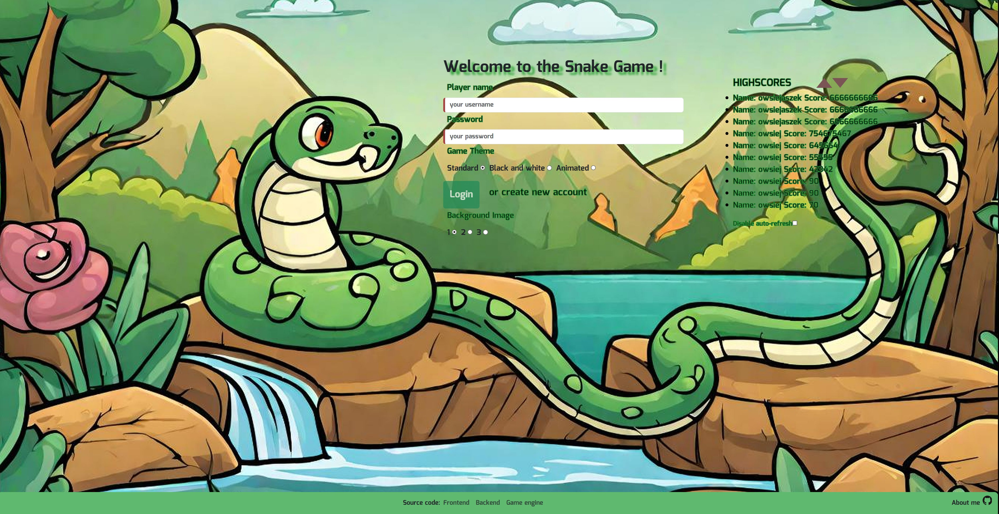
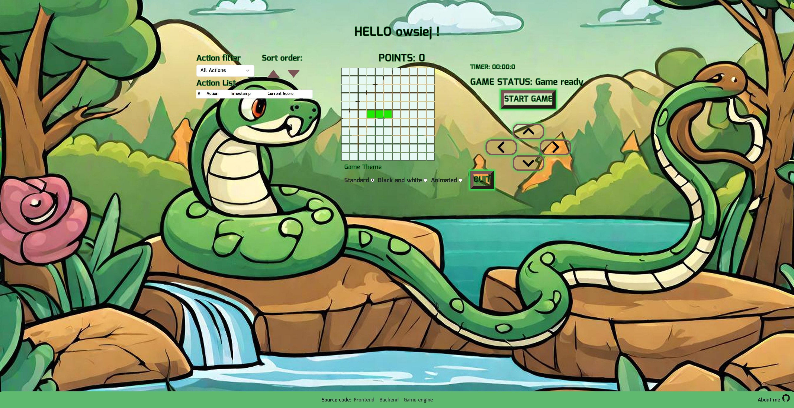
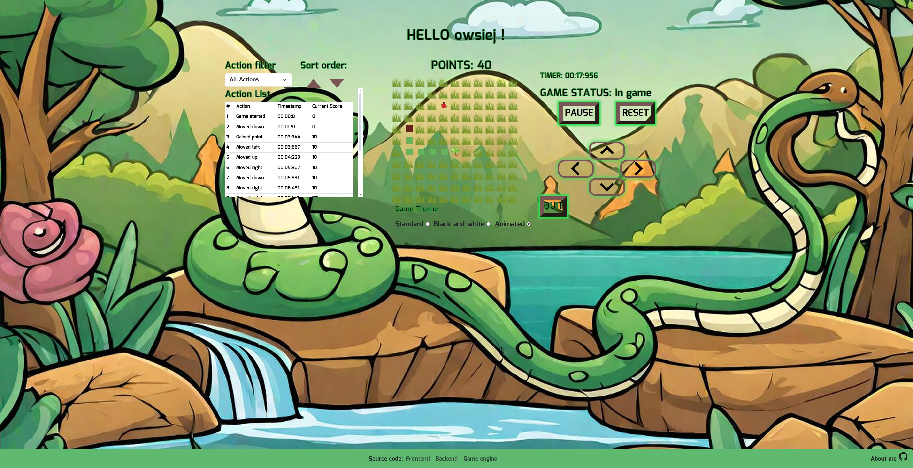
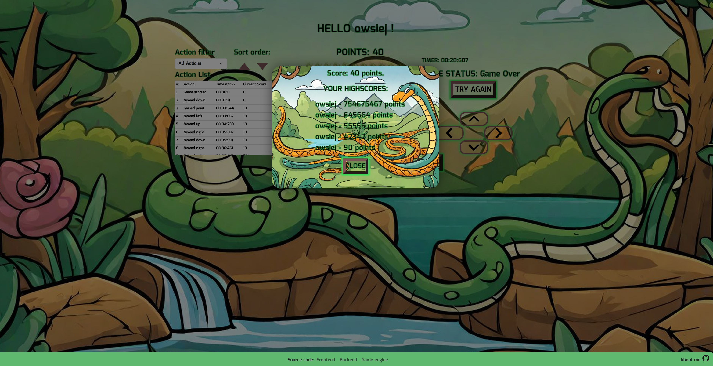

<a name="readme-top"></a>

<br />
<div align="center">

<h3 align="center">Snake game</h3>

  <p align="center">
    One of the most popular browser/mobile games written in Angular.

</div>

<!-- TABLE OF CONTENTS -->
<details>
  <summary>Table of Contents</summary>
  <ol>
    <li>
      <a href="#about-the-project">About The Project</a>
      <ul>
        <li><a href="#features">Features</a></li>
        <li><a href="#built-with">Built With</a></li>
      </ul>
    </li>
    <li>
      <a href="#getting-started">Getting Started</a>
      <ul>
        <li><a href="#prerequisites">Prerequisites</a></li>
        <li><a href="#installation">Installation</a></li>
        <li><a href="#deployment">Deployment</a></li>
      </ul>
    </li>
    <li><a href="#usage">Usage</a></li>

  </ol>
</details>

<!-- ABOUT THE PROJECT -->

## About The Project

Game was one of the task on postgraduate studies I finished. I pushed this project a little bit further, adding some new features. I have also written backend to this game [available in a separate repository on my GitHub](https://github.com/owsiej/scores-api).

### Features:

- login/register form
- list of game highscores on main page auto-refreshing every 30 seconds with checkbox to disable it
- jwt tokens received from backend are stored in local storage and put to every necessary request with interceptor
- interceptor which will redirect you to the login page (logout immediately) upon receiving response from the backend with 401 status code caused by everything besides your token expiration
- 2 guards, one blocks entry to game page when you aren't logged and second one redirects from login page to game page, if you are logged in
- game background has got three different themes
- when the game is over, your score will be sent to backend and your personal highscores will be displayed
- if your access token runs out (causing a 401 error and hasTokenExpired flag), the refresh token interceptor will silently get you new tokens.

<p align="right">(<a href="#readme-top">back to top</a>)</p>

### Built With

<div style="display: flex;">
<a href="https://angular.dev">
  
</a>
<a href="https://rxjs.dev">
  
</a>
  <a href="https://getbootstrap.com">
  
  <a href="https://code.visualstudio.com">
  
  
</div>
<p align="right">(<a href="#readme-top">back to top</a>)</p>

## Getting Started

### Prerequisites

First start with installing `npm`.

```sh
npm install npm@latest -g
```

### Installation

1. Clone the repo
   ```sh
   git clone https://github.com/owsiej/snake-game-angular
   ```
2. Jump to root directory
   ```sh
   cd snake-game-angular
   ```
3. Install NPM packages
   ```sh
   npm install
   ```
4. Set up your backend urls in `/environments` files for both development and production deployment

   ```js
   // EXAMPLE
   export const environment = {
     production: false,
     apiUrl: "http://localhost:3000",
   };
   ```

### Deployment

For dev server run available then under `http://localhost:4200/`

```sh
npm serve
```

or for production:

```sh
npm serve --configuration=production
```

Dev will use `/environments/environment.ts` file and prod will run with `/environments/environment.prod.ts`

<p align="right">(<a href="#readme-top">back to top</a>)</p>

<!-- USAGE EXAMPLES -->

## Usage

Whole game is compatible with my backend available in other repo [here](https://github.com/owsiej/scores-api).

<p align="right">(<a href="#readme-top">back to top</a>)</p>





